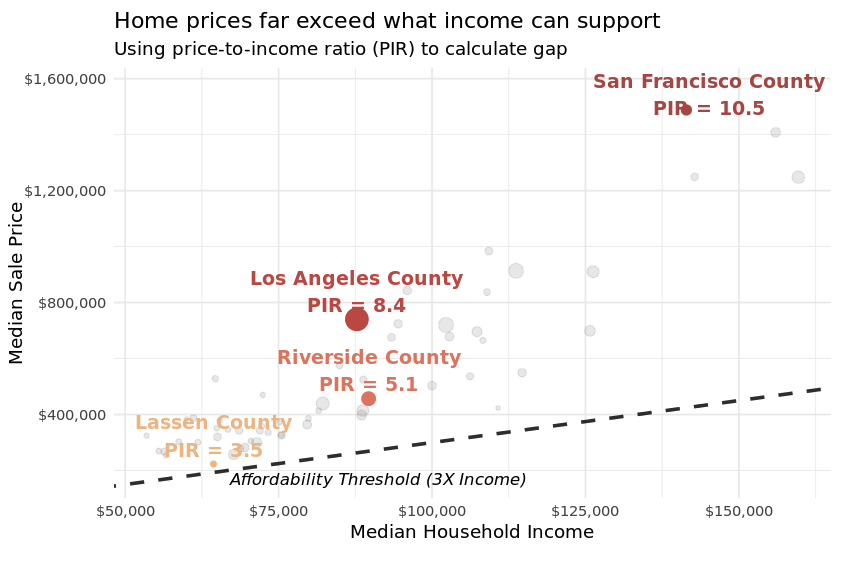
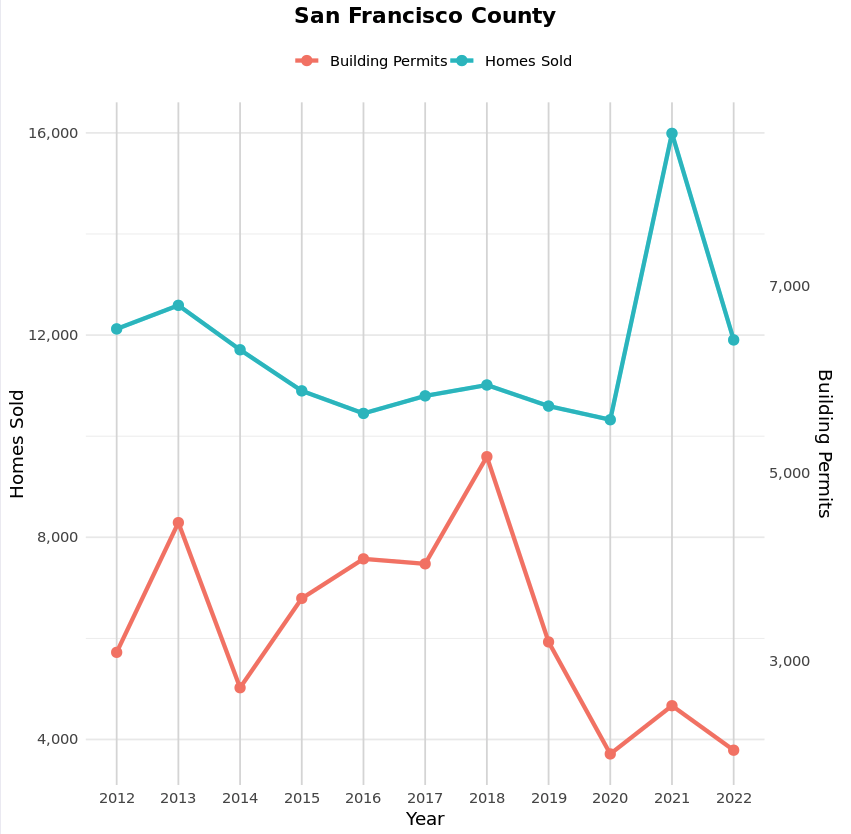
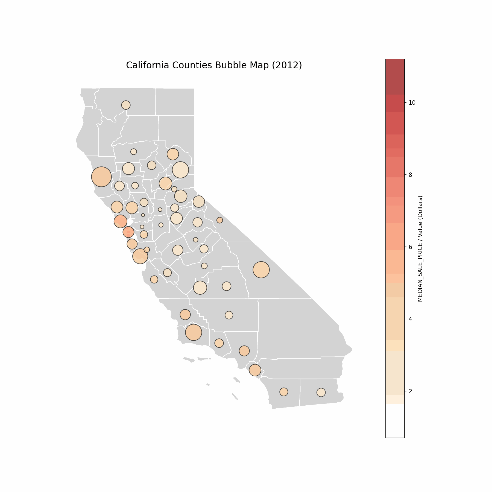

# California Housing: The Gravity of Affordability

### 📊 Project Overview
This project investigates the **"Gravity of Affordability"** in the California housing market. By integrating construction permit data with market sales and demographic trends, we analyzed how housing supply responds—or fails to respond—to price signals and migration pressures across key counties (San Francisco, Los Angeles, Riverside).

[View the Full Presentation (PDF)](housing_datavis.pdf)

**Key Research Questions:**
* **The Landscape:** How is affordability distributed across the state?
* **The "Gravity" Effect:** Does low affordability drive migration to peripheral counties?
* **Supply Elasticity:** Do construction permits increase proportionally when home prices and demand skyrocket?

---

### 🖼️ Key Insights & Visualizations

#### 1. The Affordability Gap (Price-to-Income Ratio)
We calculated the Price-to-Income Ratio (PIR) to measure the widening gap between median household income and median home prices.
* **Finding:** In core urban centers like San Francisco and LA, home prices have decoupled from local incomes, far exceeding the standard "3x Income" affordability threshold.



#### 2. Supply vs. Demand Mismatch
By overlaying "Homes Sold" (Demand) against "Building Permits Issued" (Supply) over time.
* **Finding:** In San Francisco, supply is highly inelastic; despite massive price increases, permit volume has not risen proportionally to meet demand.



#### 3. Regional Shifts
Visualizing the shift in housing pressure across the state.



---

### 📂 Data Sources
The analysis integrates three distinct datasets to create a comprehensive view of the market:

| Dataset | Source | Description |
| :--- | :--- | :--- |
| **Market Data** | [Redfin Data Center](https://www.redfin.com/news/data-center) | Monthly sales volume, inventory, and median prices (2012–Present). |
| **Supply Data** | [HUD User](https://www.huduser.gov/) | Residential construction permits by county (1980–2022). |
| **Demographics** | [NIH / HDPulse](https://hdpulse.nimhd.nih.gov/) | Median Household Income and Population estimates by county. |

---

### 🛠️ Technologies Used
* **Language:** R (Version 4.x)
* **Libraries:**
    * `tidyverse` (Data manipulation)
    * `ggplot2` (Visualization)
    * `scales` & `ggrepel` (Formatting and labeling)
    * `maps` (Geospatial analysis)
* **Environment:** Developed in Hex, exported to Jupyter Notebook (`.ipynb`) for reproducibility.

---

### 💻 How to Run This Project

1.  **Clone the repository**
    ```bash
    git clone [https://github.com/yourusername/california-housing-analysis.git](https://github.com/yourusername/california-housing-analysis.git)
    ```

2.  **Install R Dependencies**
    Open R or RStudio and run:
    ```r
    install.packages(c("tidyverse", "ggplot2", "scales", "ggrepel", "maps", "RColorBrewer"))
    ```

3.  **Run the Analysis**
    * Open `housing_analysis.ipynb` in VS Code (ensure the R kernel is installed).
    * Run all cells to regenerate the datasets and visualizations.

---

### 👥 Authors
**UC Berkeley MaCSS 2025**
* **Course:** Data Visualization (Prof. Rodden, GSI Yazen)
* **Team:** Ruben, Jiyang, Kaia
